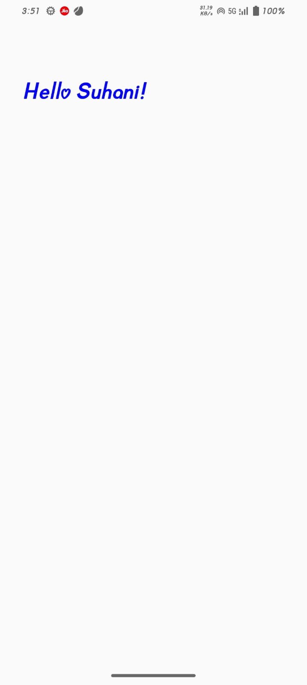

# 👋 Hello Suhani - Compose Project

A beginner-friendly Android app built using Jetpack Compose.

# 📌 Features

Displays a simple greeting: "Hello Suhani".

Demonstrates basic Compose UI elements like Text, Column, and Modifier.

First step in learning Jetpack Compose for modern Android development.

# 🛠️ Tech Stack

Language: Kotlin

UI: Jetpack Compose

Architecture: Basic Compose structure

# screenshots

### MAIN SCREEN

# 🚀 Usage

Open the project in Android Studio Arctic Fox or later.

Run the app on an emulator or device.

See the greeting displayed on the screen.

# 🔮 Future Improvements

Add buttons and interactivity.

Explore state handling with remember and mutableStateOf.

Build more complex layouts and learn Compose theming.
